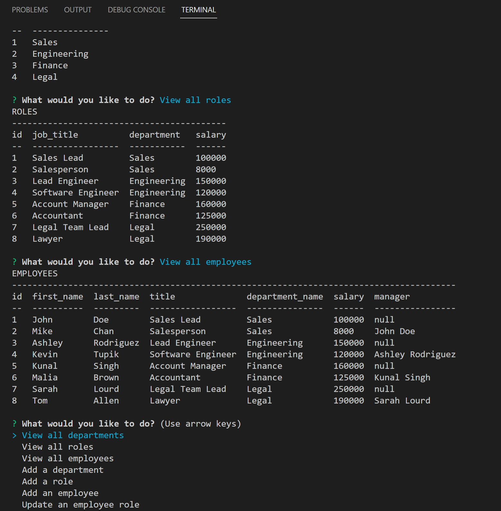

# employeeTracker

## Installation
After downloading the app's source files, the user must install the packages listed as dependencies in the package.json file. These packages include: console.table, express, inquirer, and mysql2. The user then must use the schema.sql file in the db folder of the source code to create the tables. The user may then choose to use the seeds.sql file to populate the tables with example data or they may choose to begin running the app and enter their own data.

## Usage
The app is run in the command line using Node. When the app is run, it connects to the business database and begins listening on port 3001. The user is then presented with a menu including options allowing them to do the following: view all departments, view all roles, view all employees, add a department, add a role, add an employee, or update an employee's role. When a user chooses to view all departments, a table containing the id and name of each department is displayed. When the user chooses to view all roles, a table containing the id, title, department, and salary of each role is displayed. When the user chooses to view all employees, a table containing the id, first name, last name, title, department name, salary, and manager of each employee is displayed. When the user chooses to add a department, they are asked to enter the name of the new department. When the user chooses to add a role, they are asked to enter the title and salary of the role. When entering the role's salary, only numeric values are accepted. They are then prompted with a list of all the available departments to choose from. After choosing between departments, the role is added to the 'roles' table of the 'business_db' database. When the user chooses to add an employee, they are asked to enter the employee's first and last names. They are then presented with a list of available roles to choose from. They are then given a list of managers to select from. Once the prompts have been answered, the new employee is added to the 'employees' table of the 'business_db' database. Managers are employees with no listed manager. When the user chooses to update an employee's role, they are prompted with a list of all the employees in the database. Once they have chosen the employee whose role they'd like to update, they are given a list of all the roles in the database to choose from. Once they have chosen the employee's new role, the employee's role is updated in the database. 

[Video Demo of App](https://drive.google.com/file/d/1tMn3zv7BVcFEXob_1dMAHSIEUhfp89Sl/view)
